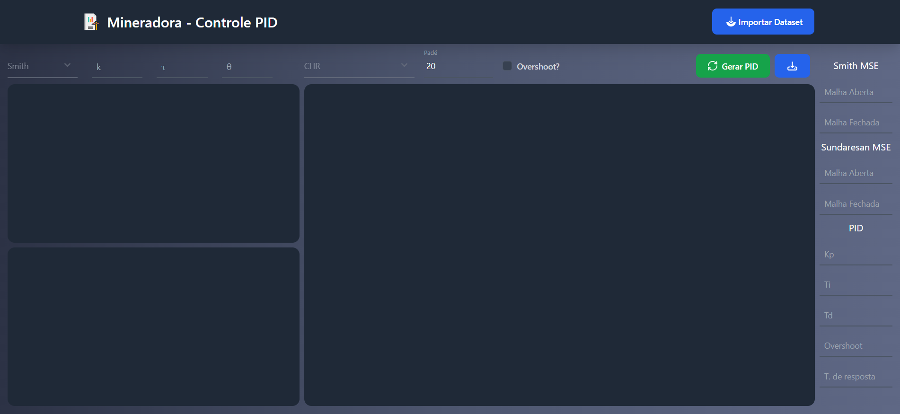

# Fuzzy PD Flight Stabilizer

### Estabilização do Controlador de Voo para Veículos Aéreos não Tripulados
Esse projeto é uma implementação de um controle de voo para veículos aéreos não tripulados utilizando o Fuzzy PD.

### Funcionalidades
- Entrada de dados
  - Set point (objetivo)
  - Fator de ajuste
  - P-Mode
- Controle de subida/descida
- RTH(Return to home)
- Base de regras
- Classificação de variáveis
  - Erro
  - Delta erro
  - Potência
- Resposta ao controle Fuzzy PD

### Home


## Tecnologias utilizadas
- Python, Flask, SocketIO e skfuzzy para o backend
- HTML, CSS, Tailwind CSS, Jinja2, JavaScript, ChartsJs e GridJs para o frontend

## Pré-requisitos

- [Python 3.10](https://www.python.org/downloads/release/python-3100/) ou superior

## Instalação
Faça o clone do repositório:

```bash
git clone https://github.com/ArthurBuenoSilva/Fuzzy-PD-Flight-Stabilizer.git
```

Acesse a pasta onde você clonou o repositório:

```bash
cd caminho/para/o/projeto
```

Crie um ambiente virtual(venv):

```bash
python -m venv venv
```

Acesse o ambiente virtual criado:

```bash
venv/Scripts/activate
```

Instale as dependências necessárias:
```bash
pip install -r requirements.txt
```

## Uso
Agora execute o script main.py:

```bash
python main.py
```

No terminal deve aparecer uma mensagem parecida com essa:

```bash
 * Serving Flask app 'app'
 * Debug mode: off
WARNING: This is a development server. Do not use it in a production deployment. Use a production WSGI server instead.
 * Running on http://127.0.0.1:49675
Press CTRL+C to quit
```

Agora que o servidor já está em execução, abra o navegador e acesse a URL exibida no terminal.

No meu caso, a URL seria http://127.0.0.1:49675.

## Contribuições

Solicitações de pull requests são bem-vindas. Para mudanças importantes, abra uma issue primeiro para discutir o que você gostaria de mudar.